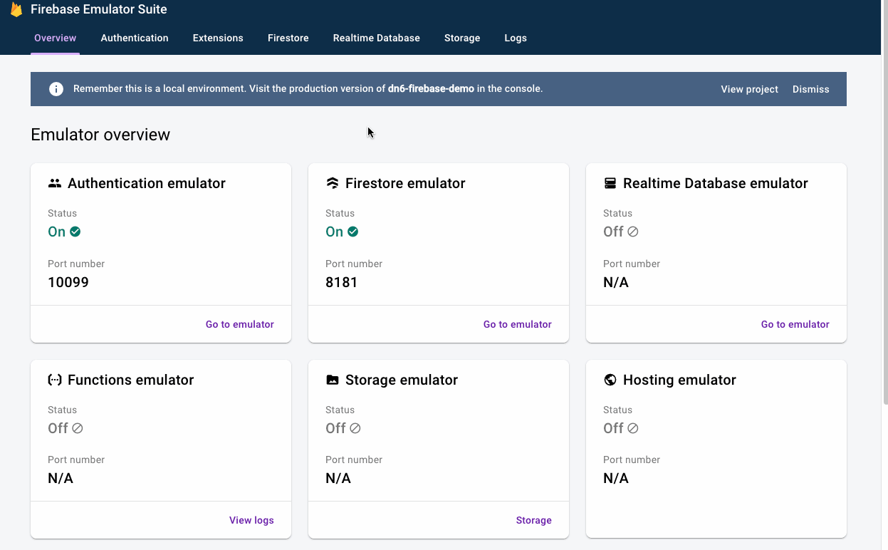
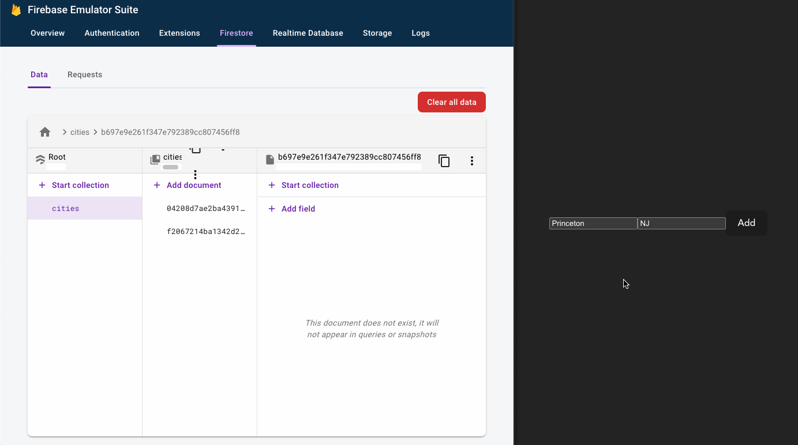
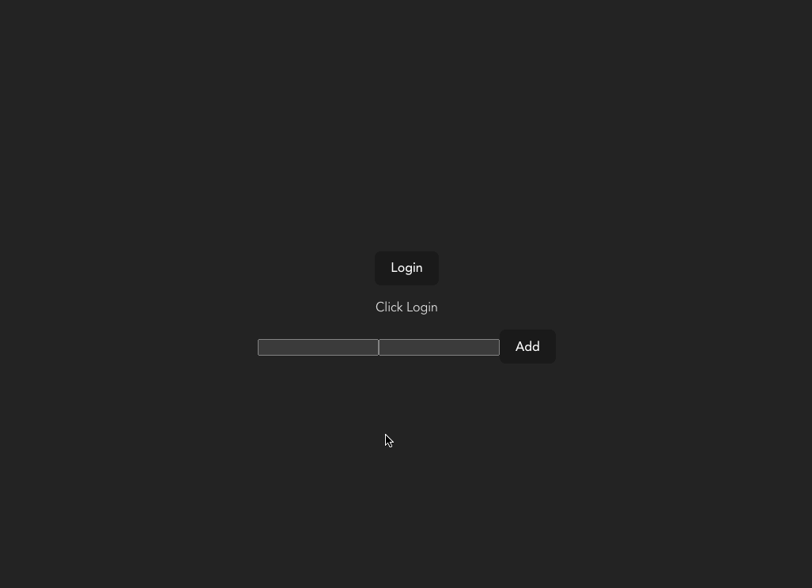
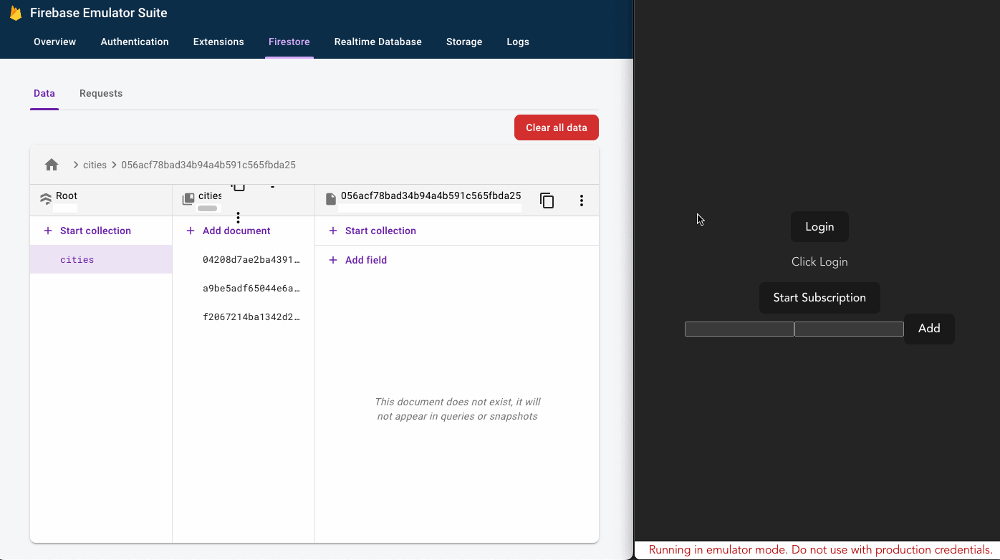

# dotnet6 + Google Firebase

This repo provides a quickstart for working with:

- dotnet6 (C#)
- Google Firebase
- Vue

If you want to set this up yourself, follow these steps.

> 💡 These steps are for macOS, but easily adaptable for Windows!

## Setup the Workspace

```bash
mkdir dn6-firebase                    # Create our working directory
cd dn6-firebase
mkdir api                             # Create a directory for our dotnet6 api
mkdir web-vue                         # Create a directory for our Vue front-end.
dotnet new gitignore                  # Create a gitignore file at the root
git init                              # Initialize git at the root

cd api
dotnet new webapi -minimal            # Initialize a minimal dotnet6 web API in C#

cd ../web-vue
yarn create vite . --template vue-ts  # Create a new Vue application with TypeScript
```

## Install the Emulator

To install the emulator, [check the Google documentation for your system](https://firebase.google.com/docs/emulator-suite/install_and_configure).

On macOS:

```bash
# From the root.
curl -sL https://firebase.tools | bash
firebase --version                    # Verify installation
firebsae login
firebase init                         # Start the firebase initialization for the workspace.
```

At this point, follow the prompts to initialize the emulator:

```bash
# ? Which Firebase features do you want to set up for this directory?
Emulators: Set up local emulators for Firebase products

# ? Please select an option
Create a new project

# ? Please specify a unique project id
dn6-firebase-demo
```

You ***must*** create a project; the app initialization will fail later on if you don't.  Don't worry, you don't have to provision any services ***in*** Google Cloud; you just need to have the project.

> 💡 If you already have a project, then you can also select it instead.

```bash
# ? Which Firebase emulators do you want to set up?
Authentication Emulator
Firestore Emulator

# Accept the defaults or enter custom ports and enable the admin UI.
# Select a port for the admin UI like 9898
# When prompted, download the emulators
```

> ℹ️ Important note: I'm using non-default ports in these examples!

At this point, you should see the following files added to your repo:

```
.firebaserc
firebase.json
```

Now start the emulator using the following command:

```bash
firebase emulators:start
```

If all goes well, you can head to:

```
http://localhost:9898
```

🎉

## Create Backend API

Now let's build our backend API.

```bash
cd api                                      # If not already in the API directory
dotnet add package Google.Cloud.Firestore   # Add the Firestore SDK
```

We'll add a record class that represents a city (you can also use a regular class!):

```csharp
/// <summary>
/// Record class that represents a city.
/// </summary>
[FirestoreData]
public record City(
    [property: FirestoreProperty] string Name,
    [property: FirestoreProperty] string State
) {
  /// <summary>
  /// The Google APIs require a default, parameterless constructor to work.
  /// </summary>
  public City() : this("", "") { }
}
```

Then add our endpoint:

```csharp
var projectId = "dn6-firebase-demo";

// Our one and only route.
app.MapGet("/city/add/{state}/{name}",
  [Authorize] async (string state, string name) => {
    var firestore = new FirestoreDbBuilder {
      ProjectId = projectId,
      EmulatorDetection = Google.Api.Gax.EmulatorDetection.EmulatorOrProduction
    }
    .Build();

    var collection = firestore.Collection("cities");
    await collection.Document(Guid.NewGuid().ToString("N")).SetAsync(
        new City(name, state)
    );
  })
  .WithName("AddCity");
```

From the command line:

```bash
# If not already in the API directory
cd api

# Start the app.  Note the environment variable!  On Windows, you'll
# need to set this or use one of the launch profiles.
FIRESTORE_EMULATOR_HOST="localhost:8181" dotnet run
```

To test our API against the emulator:

```bash
# Note the %20 for the space!
curl -v http://localhost:20080/city/add/CA/Los%20Angeles
```

Congratulations: we've created our first record!



## Create Front-end

Now let's create a simple front-end to call our API.

We'll replace our `web-vue/src/App.vue` file with a simple input:

```vue
<script setup lang="ts">
  import { ref } from 'vue'

  const cityName = ref('')
  const stateName = ref('')

  const createCity = async () => {
    const city = cityName.value
    const state = stateName.value
    const url = `http://localhost:20080/city/add/${state}/${city}`

    const response = await fetch(url, {
      method: "GET"
    });

    console.log(response);
  }
</script>

<template>
  <div>
    <input type="text" v-model="cityName" />
    <input type="text" v-model="stateName" />
    <button @click="createCity">Add</button>
  </div>
</template>
```



## Adding Login

Let's add authentication to the front-end.  For this app, we'll see how to set it up to connect to our emulator.

Start by adding `firebase` to our front-end project:

```bash
cd web-vue
yarn add firebase
```

At this point, we have to initialize the app with the upstream (read cloud hosted runtime).  If we don't initialize the app, we will get an error:

```
No Firebase App '[DEFAULT]' has been created - call Firebase App.initializeApp() (app/no-app).
```

Locate your project in [the Firebase console](https://console.firebase.google.com) and register an app (**Project settings** → **Your apps**).

Just name it `web-app` for now and click **Register app** which will generate a config:

```js
// Your web app's Firebase configuration.
// T his is not secret as it compiles into the UI package
const firebaseConfig = {
  apiKey: "AIzaSyBa_VDckwNQ2OaooVRoSJY",
  authDomain: "dn6-firebase-demo.firebaseapp.com",
  projectId: "dn6-firebase-demo",
  storageBucket: "dn6-firebase-demo.appspot.com",
  messagingSenderId: "87796597610",
  appId: "1:87796597610:web:c8d363161b2ead61811b13"
};

```

Our code now looks like this:

```js
// Holds the token once we authenticate.
const authToken = ref("");

const firebaseConfig = {
  apiKey: "AIzaSyBa_VDckwNQ2OaooVRoSJY",
  authDomain: "dn6-firebase-demo.firebaseapp.com",
  projectId: "dn6-firebase-demo",
  storageBucket: "dn6-firebase-demo.appspot.com",
  messagingSenderId: "87796597610",
  appId: "1:87796597610:web:c8d363161b2ead61811b13"
};

const app = initializeApp(firebaseConfig);
const provider = new GoogleAuthProvider();
const auth = getAuth(app);
// This routes it to our local emulator; in actual code, add a condition here.
connectAuthEmulator(auth, "http://localhost:10099");

/**
 * Function to perform authentication
*/
const firebaseLogin = () => {
  signInWithPopup(auth, provider)
    .then(async (result) => {
      const credential = GoogleAuthProvider.credentialFromResult(result);
      const token = credential!.accessToken;
      const user = result.user;
      authToken.value = await user.getIdToken();
      console.log($`Auth token: ${authToken.value}`);
    })
    .catch((error) => {
      console.log(error)
    });
};
```

Checkout the sweet authentication emulation:



We need to update our API call to send the header on our API calls:

```js
const createCity = async () => {
  const city = cityName.value;
  const state = stateName.value;
  const url = `http://localhost:20080/city/add/${state}/${city}`;

  const response = await fetch(url, {
    method: "GET",
    headers: new Headers({
      Authorization: "bearer " + authToken.value,
    }),
  });

  console.log(response);
};
```

## Backend Validation

Now we'll get a token from the frontend and we need to validate it.

Let's start by adding the `[Authorize]` attribute to the route.

```csharp
app.MapGet("/city/add/{state}/{name}",
  [Authorize] async (string state, string name) => {
      // Omitted
  })
  .WithName("AddCity");
```

Now our API call will fail since we haven't set up the token validation.

We need to add in JWT token validation code now.

Start by adding the JWT package from Microsort.

```bash
cd api
dotnet add package Microsoft.AspNetCore.Authentication.JwtBearer
```

And update our app:

```csharp
builder.Services
  .AddAuthentication(JwtBearerDefaults.AuthenticationScheme)
  .AddJwtBearer(options => {
    var isProduction = builder.Environment.IsProduction();
    var issuer = $"https://securetoken.google.com/{projectId}";
    options.Authority = issuer;
    options.TokenValidationParameters.ValidAudience = projectId;
    options.TokenValidationParameters.ValidIssuer = issuer;
    options.TokenValidationParameters.ValidateIssuer = isProduction;
    options.TokenValidationParameters.ValidateAudience = isProduction;
    options.TokenValidationParameters.ValidateLifetime = isProduction;
    options.TokenValidationParameters.RequireSignedTokens = isProduction;

    if (isProduction) {
      var jwtKeySetUrl = "https://www.googleapis.com/robot/v1/metadata/x509/securetoken@system.gserviceaccount.com";
      options.TokenValidationParameters.IssuerSigningKeyResolver = (s, securityToken, identifier, parameters) => {
        // get JsonWebKeySet from AWS
        var keyset = new HttpClient()
            .GetFromJsonAsync<Dictionary<string, string>>(jwtKeySetUrl).Result;

        // serialize the result
        var keys = keyset!.Values.Select(
            d => new X509SecurityKey(new X509Certificate2(Encoding.UTF8.GetBytes(d))));

        // cast the result to be the type expected by IssuerSigningKeyResolver
        return keys;
      };
    }
  });

builder.Services.AddAuthorization();

// Down below...

app.UseAuthentication();
app.UseAuthorization();
```

## Realtime Subscriptions

> 💡 Not best practices here; you want to create policies to ensure only authorized readers can subscribe.

Let's add a realtime subscription on our frontend so that we get an update on every city added.

We'll add an interface and `ref` for the cities:

```js
interface City {
  State: string
  Name: string
}

const cities = ref<City[]>([])
```

And add the database handle:

```js
const db = getFirestore(app);
connectFirestoreEmulator(db, "localhost", 8080);
```

Now let's add our subscription handlers:

```js
const startSubscription = () => {
  unsubscribe = onSnapshot(collection(db, "cities"), (snapshot) => {
    for (const docChange of snapshot.docChanges()) {
      const city: City = docChange.doc.data() as City

      if (docChange.type === "added") {
        cities.value.push(city)
      }

      if (docChange.type === "modified") {
        console.log("Modified: ", docChange.doc.data());
      }

      if (docChange.type === "removed") {
        var index = cities.value.findIndex(c => c.Name === city.Name)
        cities.value.splice(index, 1)
      }
    }
  });
}
```

And update our template:

```vue
<div>
    <p
      v-for="(city, index) in cities"
      :key="index">
      {{ city.Name + ', ' + city.State }}
    </p>
</div>
```

Boom:



Notice that as soon as the subscription starts, we'll get our existing cities listed.

As items are added/deleted, they are reflected in the front-end without hitting our backend.


----

## In GCP...

When running in GCP, you'll need to download the actual key assocaited to the sevice account.

You'll find this in the Firebase console:

- https://console.firebase.google.com/
- Select your project
- Click **Project settings**
- Click **Service accounts**
- Click **Generate new private key**

You can also create new service accounts as needed.

You'll also want to set up authorization policies on the paths in Firestore to ensure users can only subscribe to their documents.